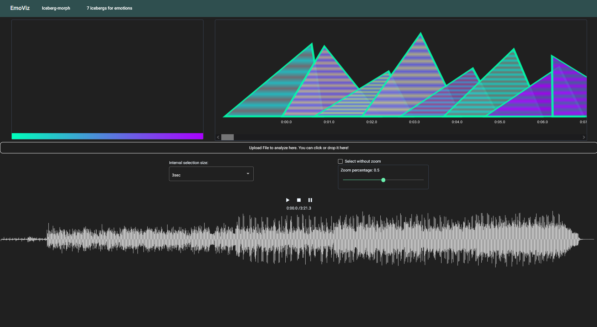

# Emotion Visualization System (Angular Project)

This project aims to provide a vizualization system for emotional data. It works with an model, trained in  [this repo](https://github.com/ckwdani/masterarbeit_programming) using soundstream and an transformer. The data used by this vizualization system are 3 dimensional. 

## Software Architecture

The Emotion Visualization System is built using the Angular framework. A significant part of the visualization relies on [Two.js](two.js.org/), a powerful open-source JavaScript library. Two.js specializes in rendering two-dimensional graphics in modern web browsers, leveraging the capabilities of the HTML5 Canvas element. It's renderer-agnostic, supporting SVG, Canvas, and WebGL contexts through a unified API. With Two.js, creating, animating, and manipulating shapes becomes effortless. It also offers compatibility with most modern web browsers and is apt for vector-based graphics, ensuring visuals remain sharp regardless of transformation or scaling.

## Features
### 1. File Upload

Upon accessing the site, users are initially greeted with a default visualization. They can drag and drop an audio file or select one from their directory. While the audio is processed in the backend, loading animations are presented. Once the backend completes its analysis, glyphs representing emotions from the audio segments are generated and displayed on a timeline. The number of glyphs corresponds to the audio's length, with each glyph representing a 3.5s segment. Users can then play the audio, observing glyph transitions that match the audio's emotional content.

### 2. Analyzing Regions
After an audio file is uploaded and played, users can delve into specific sections for a more detailed analysis. A zoom feature allows for a closer examination of specific waveform sections. Depending on user preferences, they can set the zoom percentage, effectively highlighting a portion of the waveform. Once zoomed in, users can specify an interval (e.g., 0.2s, 1s, 3.5s, 5s) for detailed analysis. When a segment is selected, it's processed in the backend, and the corresponding glyph is displayed, allowing users to both see and hear the emotion from the chosen audio section.

### 3. Select & Compare
For shorter audio files, users can directly select segments without zooming. This direct selection mode can be activated via a checkbox. Furthermore, the system provides an option to compare the innovative glyph visualization with traditional bar and radar charts. This ensures that even if users are unfamiliar or uncomfortable with the glyph visualization, they can still interpret the data using familiar chart formats.

## Elements Of The Visualizon:

The process of visual mapping is fundamental to linking data with visual channels, presenting information in an easily understandable and intuitive manner. The primary focus here is to identify potent visual channels that encode underlying data, enabling users to visually grasp comprehensive information. To maximize the efficacy of visualization, a strategic mapping approach is pivotal. Clarity, intuitiveness, and expressiveness form the crux of an apt visual graphic. For each emotion's data, it's mapped onto a glyph shaped as a three-sided polygon. Within this glyph, labels are displayed and every value from the feature vector denotes a glyph property. Identifying the most suitable visual channels is crucial for a clear and informative visualization. UMAP serves as a dimensionality reduction algorithm, condensing high-dimensional data into lower dimensions.

- **Timeline Overview**: A graphical representation that allows users to visualize data across different time points, making it easier to identify patterns, trends, and significant events over time.
- **Overview Of Average Emotions**: Provides a summarized view of the emotions captured, enabling users to gauge the predominant emotional states within the dataset.
- **Waveplot**: A dynamic visualization that showcases data in wave-like patterns, allowing for the interpretation of fluctuations and variations.
- **Control Panel**: An interactive interface that empowers users to customize and control various aspects of the visualization, enhancing user experience and interaction.
- **Morphing Iceberg**:     A unique visualization that represents data in the form of an iceberg, with its shape and size morphing based on the underlying data. This offers a visually striking way to interpret and understand the depth and magnitude of the data.

